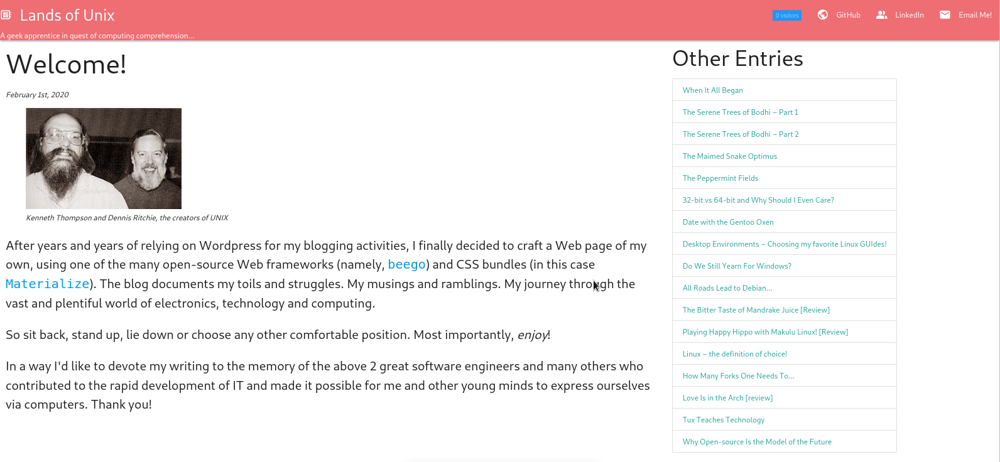

Description
---
A small Web development project for my personal website/blog. *It's largely a work-in-progress!*

Introduction
---

**Front-end:**  
    - HTML/CSS via [Materialize](https://materializecss.com)  
    - dynamic HTML templating via [beego](https://github.com/astaxie/beego)  
**Back-end:**  
    - MVC via [beego](https://github.com/astaxie/beego)  
    - Static data definitions via [postgresql](https://www.postgresql.org/)
    - Dynamic data definitions via [redis](https://redis.io/)  
**Web serving (WIP):**  
    - reverse-proxy & load-balancing via [caddy](https://caddyserver.com/)  
**Deployment (WIP):**  
    - containerization via [Docker](https://www.docker.com/)  

The project follows the [MVC design pattern](https://en.wikipedia.org/wiki/Model%E2%80%93view%E2%80%93controller), though as implemented by the Ruby on Rails project, rather than by Django. I also took some liberty in the way routing controller objects are spawned and generic HTTP responses handled.

Preview
---
**NOTICE:** The project now relies on a running PostgreSQL server for its back-end, therefore none of the entries and comments will 
be visible when running outside of the deployment host. However, if you're curious how the front-end works, it can be built and run using Docker (Dockerfile provided). Make sure to expose and map port `8080` properly :). The finished project will look like this:

Requirements
---
* https://github.com/astaxie/beego
* https://github.com/smartystreets/goconvey/convey
* https://github.com/lib/pq
* https://github.com/go-redis/redis
* https://github.com/google/uuid
